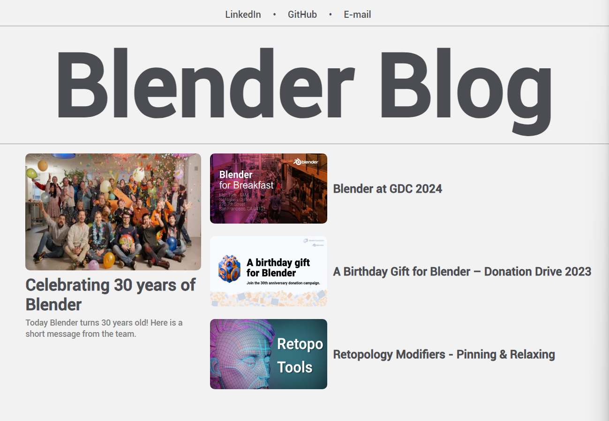

# Blog Page built using Angular
This is a blog page built during the DIO course [FrontEnd Development with Angular](https://www.dio.me/bootcamp/coding-future-banco-pan-desenvolvimento-frontend-com-angular).

The focus of this project was using components and getting familiar with Angular.

Tools used in this project:
- Angular Framework
- SASS/CSS
- HTML

## Preview

